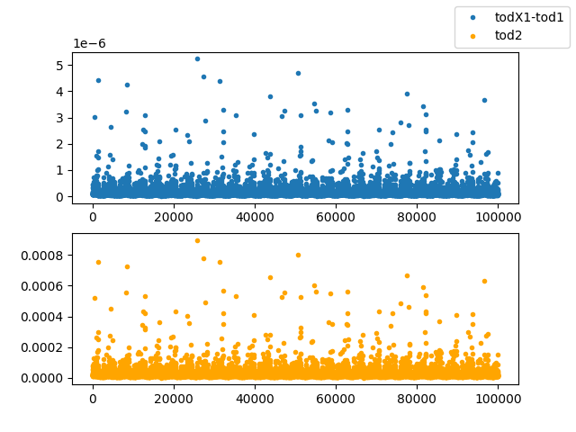

# <Untitled>

The simulation starts at t0=0 and lasts 31536000 seconds.

The seed used for the random number generator is 12345.

[TOC]

Here is the Crosstalk matrix
    

## Generation of spacecraft quaternions

Quaternions have been created for the simulation:

- One quaternion every 60.0 seconds;
- Memory usage: 16.8 MB

## Pointing generation

Pointing information for  detectors has been generated.

- Number of MPI processes: 1
- Number of observations: 1
- HWP: No HWP
- Total memory (for θ, φ, ψ): 16.8 MB

Here is the Coverage map for this simulation
    

Here is the input map in the 40 GHz channel
    

Here we can see the Time Ordeed Data (TOD) for two representative frequency channels of the LFT telescope.
        The peaks correnspond to galactic emission.
    

Here we can see the TOD for the simulation, with and without crosstalk
    

Residual Crosstalk TOD
    

Finalluy here we can see the reconstructed maps.
    
    
    

Finalluy here we can see the reconstructed maps for the crosstalk residual .
    
    
    

## Pointing generation

Pointing information for  detectors has been generated.

- Number of MPI processes: 1
- Number of observations: 1
- HWP: No HWP
- Total memory (for θ, φ, ψ): 16.8 MB

Finalluy here we can see the reconstructed maps for the crosstalk residual from the TOD of the first detector only.
    
    

Finalluy here we can see the reconstructed maps for the crosstalk residual .
    

## Instrument model objects

## Source code used in the simulation

-   Main repository: [github.com/litebird/litebird_sim](https://github.com/litebird/litebird_sim)
-   Version: 0.13.0, by The LiteBIRD simulation team
-   Commit hash: [e03a641](https://github.com/litebird/litebird_sim/commit/e03a641940797df6699fb96ec1130b5e9eb0034c)
    (commit comment: *Initial commit*, by eudigiorgi)

---

Report written on 2024-11-07 09:57:18

